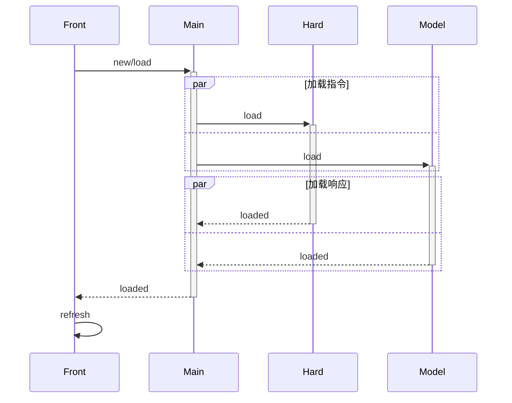

# RT6 基本工作响应图

## 新建或加载

图中：

- Front 前端
- Main 后端主控（集成器）
- Hard 硬件资源管理
- Model 仿真模型管理

```mermaid
sequenceDiagram

participant Front
participant Main
participant Hard
participant Model

Front ->>+ Main: new/load
par 加载指令
  Main ->>+ Hard: load
and
  Main ->>+ Model: load
end
par 加载响应
  Hard -->>- Main: loaded
and
  Model -->>- Main: loaded
end
Main -->>- Front: loaded
Front ->>+ Front: refresh
```

